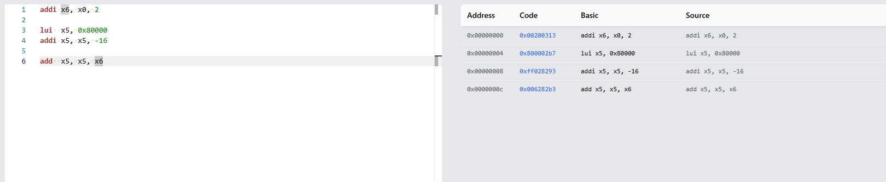

There are **three separate problems** in those instructions. You're very close to the right idea, but you've mixed up instruction types again.

Your code:

```asm
add  x6, x0, 0x00000002
lui  x5, 0x7ffffff0
add  x5, x5, -16
addi x5, x5, x6
```

### 1. `ADD` cannot take `2` directly

`ADD` requires **three registers**:

```asm
add rd, rs1, rs2
```

So this:

```asm
add x6, x0, 2
```

is invalid.

Use:

```asm
addi x6, x0, 2
```

Now:

```text
x6 = 2
```

---

### 2. Your `LUI` value is wrong

You wrote:

```asm
lui x5, 0x7ffffff0
```

But `LUI` takes a **20-bit immediate**, not a complete 32-bit value.

You cannot put:

```text
0x7ffffff0
```

into `LUI`.

If you want:

```text
x5 = 0x7ffffff0
```

use:

```asm
lui  x5, 0x80000
addi x5, x5, -16
```

giving:

```text
LUI:
0x80000 << 12
= 0x80000000

ADDI:
0x80000000 - 16
= 0x7ffffff0
```

---

### 3. `ADD` cannot use `-16`

You wrote:

```asm
add x5, x5, -16
```

Again, `ADD` requires a register as the third operand.

If you want to add an immediate:

```asm
addi x5, x5, -16
```

---

### 4. Your final `ADDI` is backwards

You wrote:

```asm
addi x5, x5, x6
```

But `ADDI` means:

```text
ADDI rd, rs1, immediate
```

The third operand must be a **12-bit immediate**, not a register.

If `x6 = 2` and you want:

```text
x5 = x5 + x6
```

use:

```asm
add x5, x5, x6
```

---

## Correct version

If your goal is:

```text
x6 = 2
x5 = 0x7ffffff0
x5 = x5 + x6
```

write:

```asm
addi x6, x0, 2

lui  x5, 0x80000
addi x5, x5, -16

add  x5, x5, x6
```

Result:

```text
x6 = 0x00000002

x5 = 0x7ffffff0
   + 0x00000002
   = 0x7ffffff2
```

### The rule you need to memorise

```text
ADD
add  rd, rs1, rs2
     │    │    └── register
     │    └─────── register
     └──────────── register

ADDI
addi rd, rs1, imm
     │    │    └── number
     │    └─────── register
     └──────────── register

LUI
lui rd, imm20
    │    └────── 20-bit immediate
    └─────────── register
```

So whenever you see **two registers + a number**, you're probably looking for `ADDI`, not `ADD`.
